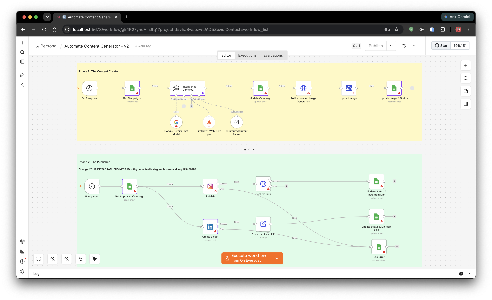

# AI Content Engine & Social Publishing Automation

### Overview

Designed and implemented a fully automated AI-powered content generation and publishing pipeline that creates marketing copy, generates AI images, and publishes content across LinkedIn and Instagram without manual intervention.

---

### Business Problem

- Manual content creation consumed over 8 hours each week.
- Publishing across multiple platforms was repetitive and error-prone.
- Marketing assets were scattered across different tools.

---

### Solution

Built an end-to-end workflow in **n8n** using a **Google Sheets-driven content queue**.

The workflow:

1. Detects new campaigns
2. Generates LinkedIn & Instagram copy with Gemini
3. Creates AI images
4. Uploads assets to Cloudinary
5. Publishes automatically
6. Logs URLs and execution status

---

### Technologies

- n8n
- Gemini AI
- Google Sheets API
- Cloudinary API
- LinkedIn API
- Instagram Graph API

---

### Business Impact

- Reduced manual work from 8+ hours/week to fully automated publishing
- Single source of truth for campaigns
- Easily extensible to additional social platforms

---

### Links

GitHub _(if available)_
