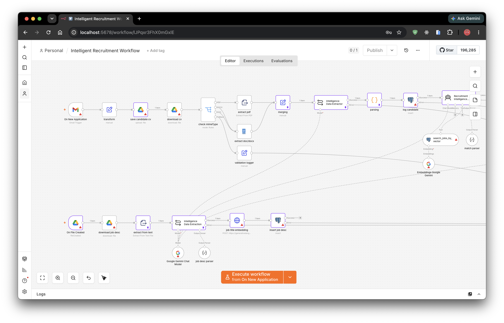
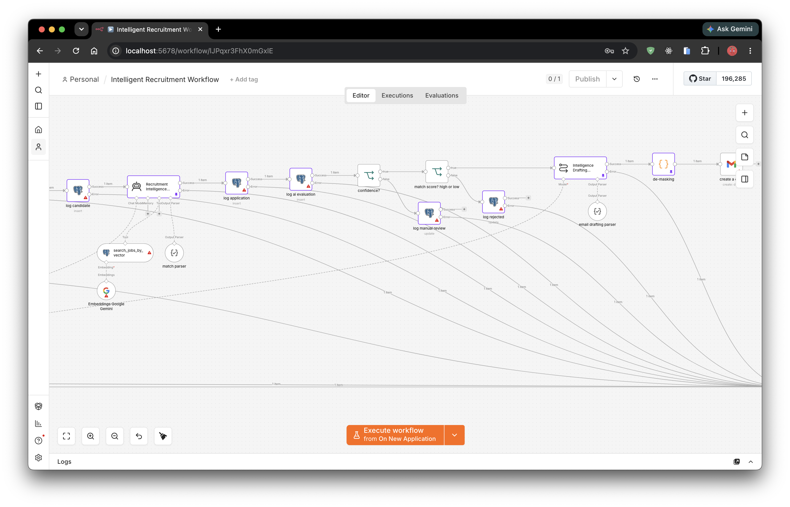

# AI Resume Screener & Recruiter Automation

## Overview

Designed and implemented an AI-powered recruitment automation platform that screens incoming resumes, matches candidates against multiple job openings using Retrieval-Augmented Generation (RAG), and assists recruiters with interview scheduling.

---

## Business Problem

The recruitment team spent significant time manually reviewing resumes, comparing candidates against multiple job descriptions, and coordinating interview invitations. As hiring volume increased, the manual process became slow, inconsistent, and difficult to scale.

---

## Solution

Built an intelligent recruitment workflow in **n8n** using **Google Gemini** and **PostgreSQL (PGVector)**.

The workflow automatically:

* Monitors Google Drive for new or updated Job Descriptions
* Extracts and indexes JD content into PostgreSQL using vector embeddings
* Receives candidate applications from Gmail
* Parses PDF/DOCX resumes
* Retrieves the most relevant Job Description using semantic search (RAG)
* Evaluates candidate-job fit with Google Gemini
* Generates:

  * Match Score
  * Confidence Score
  * Candidate assessment summary
* Routes low-confidence candidates for HR review
* Drafts personalized interview invitations with Calendly links for qualified applicants

---

## Key Technologies

* n8n
* Google Gemini
* PostgreSQL + PGVector
* Retrieval-Augmented Generation (RAG)
* AI Agent / Tool Calling
* Gmail API
* Google Drive API
* Slack
* Calendly

---

## Business Impact

* Reduced initial resume screening from several days to **under three minutes per candidate**
* Enabled semantic matching across multiple active job openings
* Reduced recruiter workload by automatically drafting interview invitations
* Eliminated the need for a dedicated vector database by using PostgreSQL with PGVector
* Human-in-the-loop review ensured reliable decision-making for low-confidence matches

---

## Architecture Highlights

* Hybrid RAG architecture using PostgreSQL as both relational and vector database
* AI-powered candidate evaluation with structured scoring
* Human-in-the-loop workflow for exception handling
* Modular workflow design allowing new hiring pipelines to be added with minimal changes

---

### Links

[GitHub](https://github.com/alee0510/ai_automation_portfolio/blob/main/workflows/AI%20Resume%20Screener%20%26%20Recruiter%20Automation.json)

